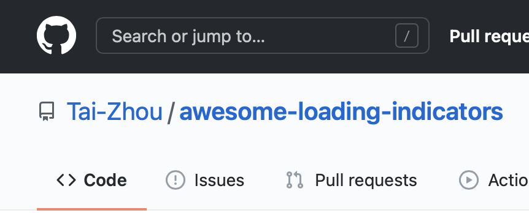
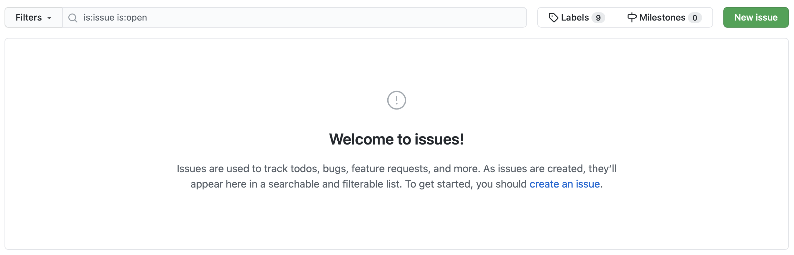
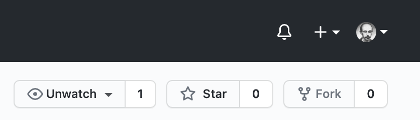
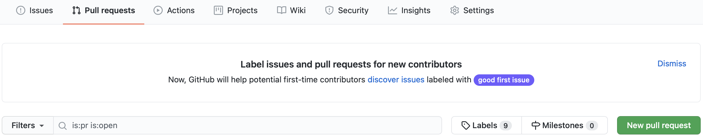
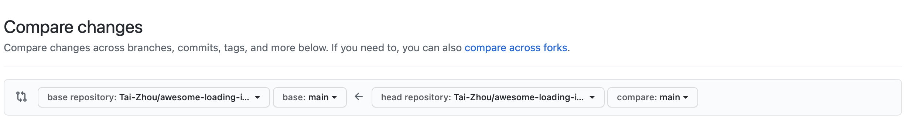

# Contribution Guidelines

## Open an Issue

1. Click the "Issues" buttom: 
2. Search for existing issues: 
3. If not found, click the green button to open a new issue.

## Create a Pull Request

1. Fork the repository: 
2. Edit the code in your own repository.
3. Commit your modification to your own repository.
4. Click the "Pull request" buttom in **this repository**: 
5. Click the green button to create a pull request: 
6. Click "compare across forks" and choose your fork: 
7. Create a pull request.
